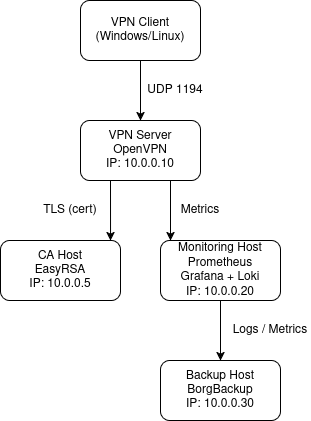

# VPN Infrastructure Project

---

## Схема инфраструктуры

---

## Описание проекта
Учебный проект по построению базовой инфраструктуры:
- собственный центр сертификации (CA)
- VPN-сервер
- мониторинг
- резервное копирование
- автоматизация и документация

Проект ориентирован на уровень Junior DevOps / SysAdmin.

---

## Схема потоков данных

Подробная схема потоков данных описана в файле:
[artifacts/data-flow.md](artifacts/data-flow.md)

---

## Требования к инфраструктуре
- Linux VM (Debian / Ubuntu / Arch)
- Доступ по SSH
- Минимум 2 VM:
  - vpn-server
  - backup-host

---

## Используемые инструменты
- OpenVPN
- Easy-RSA (CA)
- Prometheus
- Grafana + Loki
- BorgBackup
- systemd
- bash

---

## Архитектура проекта

### Состав серверов
- **CA-host** — выпуск и подпись сертификатов
- **VPN-server** — OpenVPN
- **Monitoring-host** — Prometheus, Grafana, Loki
- **Backup-host** — BorgBackup, хранение артефактов

---

## Схема взаимодействия (упрощённо)

VPN-клиент  
→ OpenVPN (1194/udp)  
→ внутренняя сеть

Promtail  
→ Loki (3100)

Prometheus  
→ exporters (9100)

---

## Как администратору добавить нового VPN-пользователя
1. Создать CSR
2. Подписать сертификат в CA
3. Сформировать конфигурацию клиента
4. Передать пользователю инструкции

---

## Резервное копирование
- Бэкап CA
- Бэкап конфигураций
- Минимум 2 копии
- systemd timer

---

## Мониторинг
- Проверка доступности сервисов
- Логи через Loki
- Алерты при сбое бэкапов

---

## Дополнительно
Проект расширяем:
- Terraform
- Ansible
- CI/CD
- Vault

